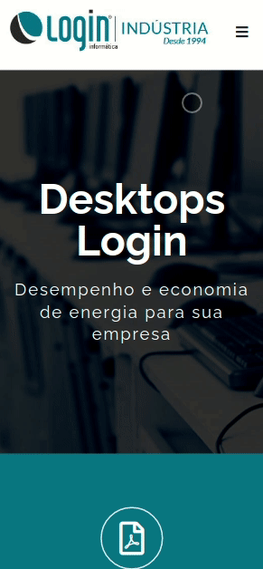
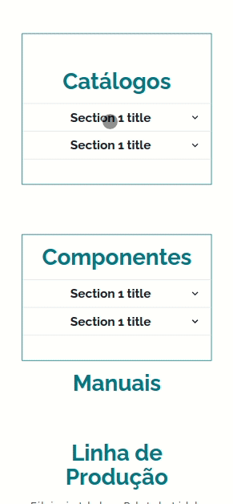

<h1 align="center">Site Institucional</h1>

Site institucional feito para empresa Login Informática com o objetivo de mostrar a sua indústria. O site tem como finalidade também demonstrar requisitos obrigatórios de licitações do governo, um dos ramos na qual a empresa atua. O compartilhamento do código foi autorizado pela empresa.

  <h3> 🚧 Em desenvolvimento 🚀 </h3>
  <strong><a href="https://loginindustria.vercel.app/">🔗 Acompanhe em tempo real - Clique Aqui</a></strong>

  <h2>Sumário</h2>
  <ul style="display: flex; justify-content: center; list-style: none">
    <li style="margin-right: 1rem"><a href="#funcionalidades">Funcionalidades</a></li>
    <li style="margin-right: 1rem"><a href="#imagens">Imagens</a></li>
    <li style="margin-right: 1rem"><a href="#tecnologias">Tecnologias</a></li>
    <li style="margin-right: 1rem"><a href="#autor">Autor</a></li>
  </ul>

<h4>Funcionalidades</h4>
- [x] Institucional Fábrica
- [x] Carrossel de Certificados
- [x] Modal de Descrição dos Certificados
- [x] Galeria de Computadores
- [ ] Input de Catálogos para Exibição via DatoCMS com GraphQL
- [ ] Páginas de Ferramentas de Suporte
- [ ] Formulário de Contato por E-mail
- [ ] Animações de Navegação com Framer Motion
- [ ] Boas Práticas de SEO

 

<h3>Tecnologias:</h3>
As ferramentas utilizadas estão sendo:
<ul style="list-style: none">
  <li>Javascript</li>
  <li>Next.Js</li>
  <li>TailwindCSS</li>
  <li>GraphQL</li>
  <li>DatoCMS</li>
</ul>

  <h3> 🚧 Em desenvolvimento 🚀 </h3>
  <strong><a href="https://loginindustria.vercel.app/">🔗 Acompanhe em tempo real - Clique Aqui</a></strong>

<h3>Autor:</h3>

Alex Santos

